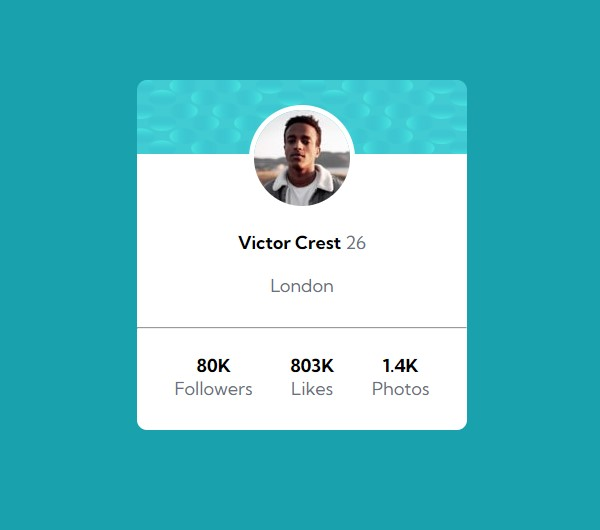

# Frontend Mentor - solução de componente de cartão de perfil

Esta é uma solução para o [desafio do componente do cartão de perfil no Frontend Mentor](https://www.frontendmentor.io/challenges/profile-card-component-cfArpWshJ). Os desafios do Frontend Mentor ajudam você a melhorar suas habilidades de codificação criando projetos realistas.

## Índice

- [Visão geral](#visão-geral)
   - [O desafio](#o-desafio)
   - [Captura de tela](#captura-de-tela)
   - [Links](#links)
- [Meu processo](#meu-processo)
   - [Construído com](#construído-com)
- [Autor](#autor)

## Visão geral

### O desafio

- Construir o projeto de acordo com os designs fornecidos.

### Captura de tela

### Links

- URL da solução: [https://github.com/Maicaoxd/cartao-de-perfil](https://github.com/Maicaoxd/cartao-de-perfil)
- URL do site ao vivo: [https://maicaoxd.github.io/cartao-de-perfil/](https://maicaoxd.github.io/cartao-de-perfil/)

## Meu processo

### Construído com

- Marcação HTML5 semântica
- Propriedades personalizadas CSS3
- Flexbox

## Autor

- Website - [Maicon Alves Guedes](https://github.com/Maicaoxd)
- Frontend Mentor - [@yourusername](https://www.frontendmentor.io/profile/Maicaoxd)